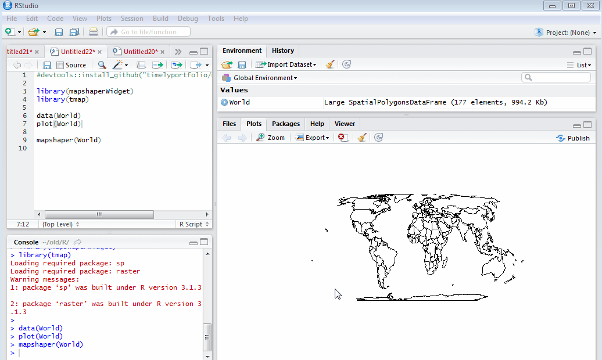

# R `htmlwidget` for mapshaper

[mapshaper](https://github.com/mbloch/mapshaper) is an incredibly powerful set of tools to simplify and edit maps from `Shapefile`, `geoJSON`, `TopoJSON`, and other file formats.  This `htmlwidget` brings `mapshaper` to your `R` experience.

```r
#devtools::install_github("timelyportfolio/mapshaper_htmlwidget")

library(mapshaperWidget)
library(tmap)
library(sp)

data(World)
plot(World)

mapshaper(World)
```



## To-do

- Hook it up to `Shiny` so the export result is returned to `R` or the hover info is provided to `R`.
- Separate JS dependencies, namespace css, and isolate components so that it will play nicely with other `htmlwidgets`
